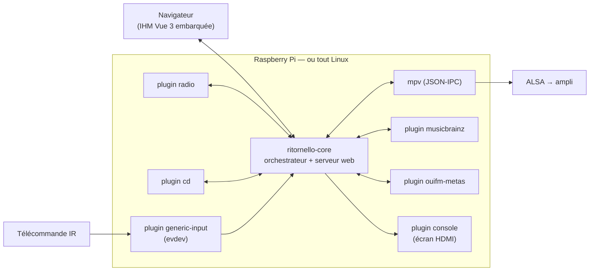

<h1 align="center">Ritornello</h1>

<em>Un poste de radio internet et lecteur CD autonome, en Rust, pour Raspberry Pi — et pour n'importe quel Linux.</em>

  

Ritornello transforme un Raspberry Pi branché sur un ampli en poste de radio
et lecteur CD qui se pilote à la télécommande infrarouge, s'affiche sur
l'écran HDMI, et s'administre depuis un navigateur sur le réseau local. Le
cœur est un orchestrateur Rust qui pilote [mpv](https://mpv.io) ; tout le
reste — sources de contenu, entrées, affichages, métadonnées — vit dans des
**plugins en processus séparés**, remplaçables sans toucher au cœur.

## L'essentiel

- **Radio internet** : 9 présélections au clavier de la télécommande,
  gestion des stations dans le navigateur, recherche dans l'annuaire
  communautaire [Radio Browser](https://api.radio-browser.info) (par nom et
  par pays), stations réordonnables par glisser-déposer.
- **Lecteur CD** : détection du disque, pistes, reconnaissance de l'album
  auprès de MusicBrainz.
- **Métadonnées du morceau en cours** : en-tête ICY du flux, enrichi par des
  plugins dédiés (MusicBrainz pour les disques, le flux de métadonnées
  d'OUI FM pour ses webradios) — affiché sur l'écran comme dans l'IHM, avec
  l'origine de l'information.
- **Télécommande configurable** : tout périphérique d'entrée Linux (evdev)
  fait l'affaire ; les touches s'apprennent depuis le navigateur, des
  presets sont livrés (MCE, clavier).
- **IHM web embarquée** (Vue 3, servie par le binaire du cœur) : état du
  lecteur poussé en continu (SSE), télécommande complète, bascule
  clair/sombre et 42 thèmes, français/anglais extensible par packs TOML.
- **Robuste par construction** : chaque plugin est un processus supervisé —
  sa mort est tolérée et signalée, jamais propagée.

  
  

## Architecture

Les plugins parlent un protocole JSON par ligne sur socket Unix, en quatre
genres : **source** (quoi jouer : radio, CD…), **input** (d'où viennent les
commandes), **display** (où afficher) et **metadata** (qu'est-ce qui joue,
exactement). Ajouter une source Bluetooth ou un afficheur OLED, c'est écrire
un binaire qui implémente l'un de ces genres — le cœur et les autres plugins
ne changent pas. Rien dans le code n'est spécifique au Raspberry Pi : evdev,
ALSA/mpv et sockets Unix tournent sur n'importe quel Linux, x86_64 comme ARM.

## Démarrage rapide

Sur la machine de développement (Node 20+, Rust, [`cross`](https://github.com/cross-rs/cross)
pour l'ARM) :

    ./deploy/build.sh                              # npm, puis cargo, puis cross ARM
    PI=pi@raspberrypi.local ./deploy/deploy.sh     # compile tout et installe via SSH

Sur l'appareil cible : `sudo apt install mpv cd-discid eject`, plus les
fichiers de configuration d'exemple — le détail pas à pas est dans
[docs/installation.md](docs/installation.md). Pour essayer sans matériel,
une instance locale se lance en cinq minutes :
[docs/developpement.md](docs/developpement.md).

## Documentation

| Document | Contenu |
|---|---|
| [docs/installation.md](docs/installation.md) | Compiler, installer sur un Pi ou un PC Linux, déployer, régler les tampons audio |
| [docs/plugins.md](docs/plugins.md) | Les plugins livrés, le genre `metadata`, écrire son propre plugin et son IHM |
| [docs/interface.md](docs/interface.md) | L'IHM web, l'API de commande, la télécommande physique, les langues, les thèmes |
| [docs/developpement.md](docs/developpement.md) | Instance locale sans matériel, tests, parcours e2e, régénération des données embarquées |

Les spécifications et plans qui ont conduit chaque chantier sont archivés
dans [docs/superpowers/](docs/superpowers/) — le projet est développé par
revues et tests systématiques, et ces documents en sont la trace.
