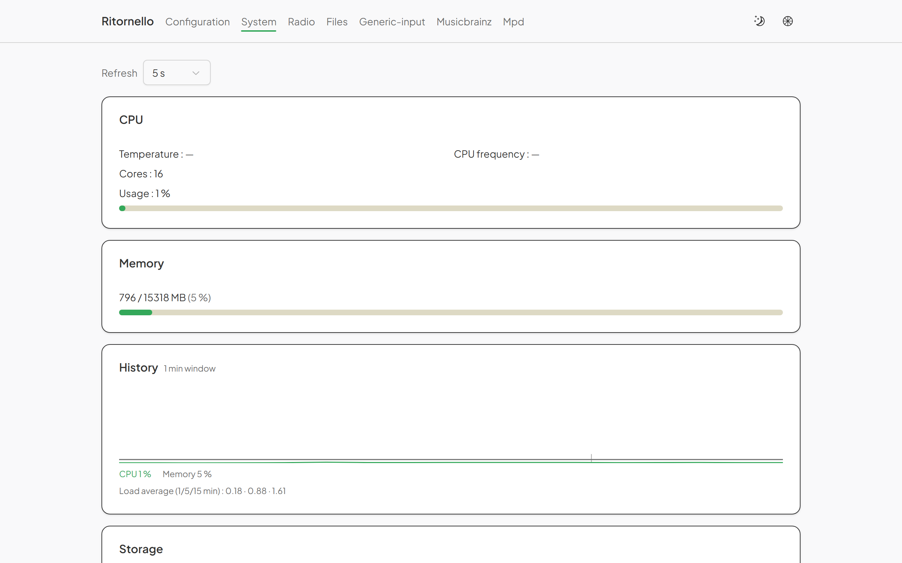
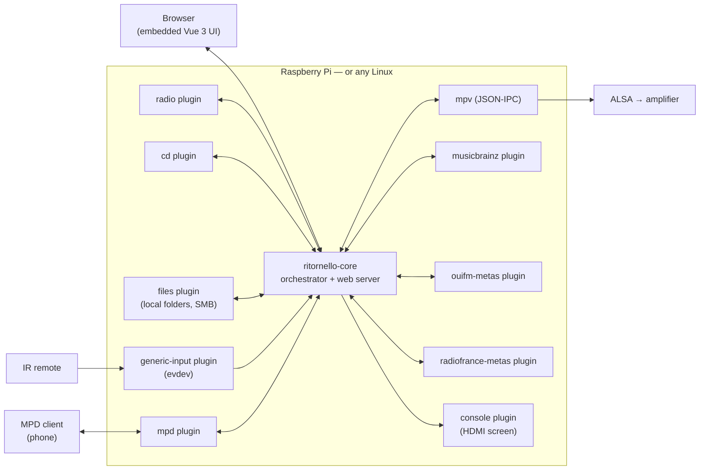

<h1 align="center">Ritornello</h1>

<p align="center"><em>A standalone internet radio and CD player, in Rust, for the Raspberry Pi — and any Linux box.</em></p>

<p align="center">
  <a href="https://github.com/skerdudou/ritornello/actions/workflows/ci.yml"></a>
  
  
  
  
  <a href="#license"></a>
</p>

<p align="center">
  
</p>

Ritornello turns a Raspberry Pi plugged into an amplifier into a radio and
CD player that is driven by an infrared remote, displays on the HDMI
screen, and is administered from a browser on the local network. The core
is a small Rust orchestrator driving [mpv](https://mpv.io); everything
else — content sources, inputs, displays, metadata — lives in **plugins
running as separate processes**, replaceable without touching the core.

## Why Ritornello?

It started as a personal itch. A Raspberry Pi 2, a CD drive and an
amplifier were sitting in the living room, and the software that used to
run them had moved on: the current releases of [Volumio](https://volumio.com)
and [moOde](https://moodeaudio.org) no longer target that generation of
hardware, and the family had never quite adopted [Mopidy](https://mopidy.com).
What the household actually wanted was simpler than any of them — press
`3` on the remote, hear the third station; put a disc in, hear the disc;
glance at the screen to know what is playing.

So Ritornello is opinionated about a few things:

- **Runs on modest hardware, for real.** The Pi 2 (1 GB of RAM, 32-bit ARM)
  is the daily-use reference machine, not a best effort. Rust and mpv
  keep the footprint small; there is no interpreter, no database server,
  no desktop stack.
- **Portable by construction.** Nothing in the code is Pi-specific: the
  remote goes through `evdev`, sound through ALSA/mpv, IPC through Unix
  sockets. The same binaries build for `armv7`, `aarch64` and `x86_64`,
  and the whole thing runs on a laptop for development.
- **Robust by construction.** Every plugin is a supervised process — its
  death is tolerated and reported, never propagated. The service runs
  **unprivileged** under a hardened systemd unit (dedicated user, device
  access through groups, `ProtectSystem=strict`).
- **Built to be extended.** A Bluetooth source, an OLED display, a
  rotary encoder or another metadata provider is one more binary that
  speaks a small line-delimited JSON protocol — in any language. The core
  and the other plugins do not change.

It was written for one household first, but it is meant to be shared: the
plugin boundary, the two-language UI, the TOML configuration and the
end-to-end test suite are all there so that the next person can add *their*
station directory, *their* screen or *their* remote without asking anyone.

## Highlights

- **Internet radio** — presets on the remote's number pad, station
  management in the browser, search in the community directory
  [Radio Browser](https://api.radio-browser.info) (by name and by
  country), stations reorderable by drag and drop.
- **CD player** — disc detection, track list, album recognition and
  cover art through MusicBrainz.
- **Audio files** — from a USB stick, a folder of the device, or an
  authenticated SMB share mounted on demand; a file browser with search;
  playlists built by adding folders recursively, saved and loaded again.
- **Now-playing metadata, with provenance** — the stream's ICY header,
  enriched by dedicated plugins (MusicBrainz for discs, OUI FM's metadata
  feed, Radio France's live endpoint for its 74 stations — which broadcast
  no ICY at all). Each field says where it came from.
- **Any remote control** — any Linux input device (`evdev`) will do,
  including a USB infrared receiver; keys are learned from the browser,
  presets ship with the project (MCE, keyboard).
- **MPD server** — the device shows up as an MPD server on port 6600, so
  existing phone clients (tested with M.A.L.P.) drive it out of the box.
- **Embedded web UI** — Vue 3, served by the core binary: player state
  pushed continuously (SSE), full remote control, light/dark toggle and 42
  themes, English/French extensible through TOML language packs, a system
  page (CPU, temperature, under-voltage, shutdown/reboot).
- **HDMI screen** — the console plugin composes now-playing and clock
  screens on the framebuffer console, no X11 or Wayland involved.

<p align="center">
  
  
</p>
<p align="center">
  
  
</p>

## Architecture



Plugins speak a line-delimited JSON protocol over Unix sockets, in four
kinds: **source** (what to play: radio, CD, files…), **input** (where
commands come from), **display** (where to show things) and **metadata**
(what exactly is playing). A plugin announces itself to the core at
startup — its kinds and, optionally, an administration page that the web
UI mounts as its own tab. `plugins.toml` only lists a name and an
executable.

| Plugin | Kind | What it does |
|---|---|---|
| `radio` | source | Internet radio, presets, Radio Browser directory, admin page |
| `cd` | source | CD drive (`/dev/sr0`), disc identification, eject |
| `files` | source | Local folders, USB, SMB shares mounted on demand, playlists, file browser |
| `generic-input` | input | Any `evdev` device: IR receiver, keyboard, remote; key learning in the browser |
| `console` | display | Now-playing and clock screens on the Linux console (HDMI) |
| `musicbrainz` | metadata | Album, year, cover art and platform links for discs and streams |
| `ouifm-metas` | metadata | OUI FM's now-playing feed (21 webradios) |
| `radiofrance-metas` | metadata | Radio France's live endpoint (74 stations without ICY) |
| `mpd` | server | Exposes the device as an MPD server for existing clients |

A Rust SDK ([`ritornello-plugin-sdk`](crates/ritornello-plugin-sdk)) provides
the traits and the runtime for each kind; the wire protocol
([`ritornello-proto`](crates/ritornello-proto)) is plain JSON, so a plugin
can equally be a Python or Go program.

## Hardware and portability

| | Status |
|---|---|
| Raspberry Pi 2 (`armv7`, 32-bit) — Raspberry Pi OS Lite, DietPi | **Reference hardware**, in daily use |
| Raspberry Pi 3/4/5 (`aarch64`) | Builds; untested for lack of hardware, no known reason it would not work |
| x86_64 Linux PC or server | Builds and runs; used for development and CI |
| Audio output | Whatever ALSA sees: the Pi's jack, HDMI, a USB DAC — selectable from the web UI |
| Remote control | Any `evdev` input device (USB IR receiver, keyboard…) |
| Display | HDMI screen through the Linux console; other displays are a plugin away |
| CD drive | Any drive Linux exposes as `/dev/sr0` |

Runtime dependencies on the target are a handful of Debian packages:
`mpv cd-discid eject` (plus `cifs-utils` for network shares).

## Quick start

On the development machine (Node 20+, Rust stable,
[`cross`](https://github.com/cross-rs/cross) for ARM):

```sh
./deploy/build.sh                              # npm, then cargo, then cross ARM
PI=pi@raspberrypi.local ./deploy/deploy.sh     # builds everything and installs over SSH
```

`deploy.sh` copies the binaries, language packs and remote presets,
installs the hardened systemd unit and provisions `/etc/ritornello` from
the example TOML files (without overwriting yours). The web UI is then at
`http://<host>:8080`. The step-by-step details, for a Pi or a plain Linux
PC, are in [docs/installation.md](docs/installation.md).

To try it **without any hardware**, a local instance runs in five minutes:
[docs/development.md](docs/development.md).

## Extending it

Writing a plugin means implementing one of the SDK traits (`SourcePlugin`,
`InputPlugin`, `DisplayPlugin`, `MetadataPlugin`) in a binary, and pointing
`plugins.toml` at it. Optionally, ship a Vue page built on the project's
component kit and it appears as a tab of the web UI. The full contract,
the bundled plugins as worked examples, and the UI recipe are in
[docs/plugins.md](docs/plugins.md).

Ideas that fit the boundary as it is today: a Bluetooth or Spotify Connect
source, an OLED/LCD display, a GPIO rotary encoder input, another radio
network's metadata feed, another language pack.

## Documentation

| Document | Contents |
|---|---|
| [docs/installation.md](docs/installation.md) | Building, installing on a Pi or a Linux PC, deploying, unprivileged service, tuning the audio buffers |
| [docs/plugins.md](docs/plugins.md) | The bundled plugins, the `metadata` kind, writing your own plugin and its UI |
| [docs/interface.md](docs/interface.md) | The web UI, the command API, the physical remote, languages, themes |
| [docs/development.md](docs/development.md) | Local instance without hardware, tests, e2e journeys, regenerating embedded data |

The specifications and plans that drove each work stream are archived in
[docs/superpowers/](docs/superpowers/) (in French) — the project is
developed through systematic reviews and tests, and these documents are
the record of that.

## Status and contributing

Ritornello is at **0.1**: it runs every day in one living room and the
feature set above is real, but the plugin protocol and the configuration
files may still change before a 1.0. CI builds the UI, runs clippy with
warnings denied, the Rust test suite and the Playwright end-to-end
journeys on every push; a `v*` tag produces the `armv7` release bundle.

Contributions are welcome — especially reports from other boards, other
DACs and other remotes, since the author only owns one of each. Open an
issue before a large change so the design can be discussed first; small
fixes and language packs can go straight to a pull request. Please keep
`scripts/ci-local.sh` green: it runs exactly what CI runs.

## License

Licensed under either of [Apache License, Version 2.0](LICENSE-APACHE) or
[MIT license](LICENSE-MIT), at your option — the usual Rust convention.

Unless you explicitly state otherwise, any contribution intentionally
submitted for inclusion in Ritornello by you shall be dual licensed as
above, without any additional terms or conditions.
