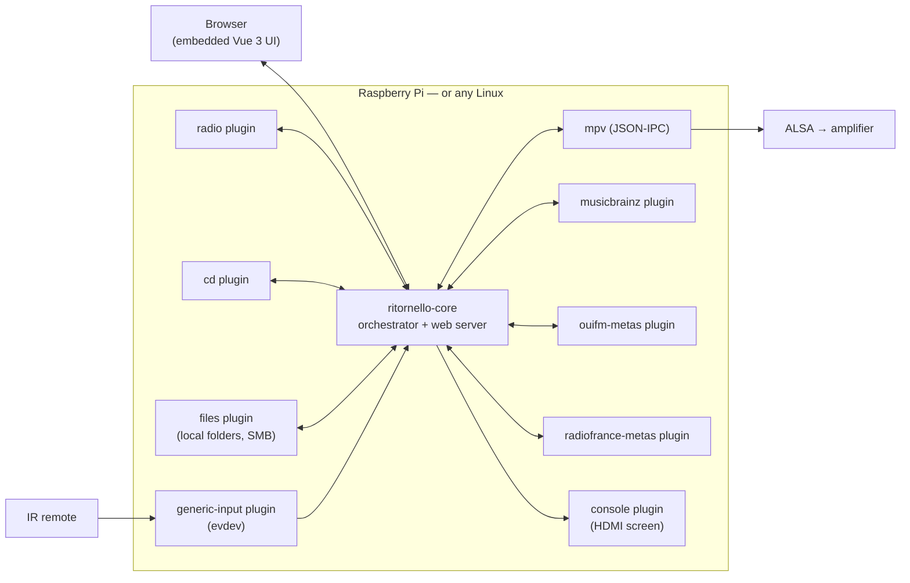

<h1 align="center">Ritornello</h1>

<em>A standalone internet radio and CD player, in Rust, for Raspberry Pi — and any Linux box.</em>

<!-- <owner> à remplacer par le compte GitHub à la publication. -->

/ritornello/actions/workflows/ci.yml/badge.svg" alt="CI">

  

Ritornello turns a Raspberry Pi plugged into an amplifier into a radio and
CD player that is driven by an infrared remote, displays on the HDMI
screen, and is administered from a browser on the local network. The core
is a Rust orchestrator driving [mpv](https://mpv.io); everything else —
content sources, inputs, displays, metadata — lives in **plugins running as
separate processes**, replaceable without touching the core.

## Highlights

- **Internet radio**: 9 presets on the remote's number pad, station
  management in the browser, search in the community directory
  [Radio Browser](https://api.radio-browser.info) (by name and by
  country), stations reorderable by drag and drop.
- **CD player**: disc detection, tracks, album recognition through
  MusicBrainz.
- **Audio files**: from a USB stick, a folder of the device, or an
  authenticated SMB share mounted on demand; playlists built by adding
  folders recursively from the browser, saved and loaded again.
- **Now-playing metadata**: the stream's ICY header, enriched by dedicated
  plugins (MusicBrainz for discs, OUI FM's metadata feed for its
  webradios, Radio France's live endpoint for its 74 stations — which
  broadcast no ICY at all) — shown on the screen and in the web UI alike,
  along with where the information came from.
- **Configurable remote control**: any Linux input device (evdev) will do;
  keys are learned from the browser, presets ship with the project (MCE,
  keyboard).
- **Embedded web UI** (Vue 3, served by the core binary): player state
  pushed continuously (SSE), full remote control, light/dark toggle and 42
  themes, English/French extensible through TOML language packs.
- **Robust by construction**: every plugin is a supervised process — its
  death is tolerated and reported, never propagated. The service runs
  **unprivileged** (dedicated system user, device access through groups,
  hardened systemd unit).

  
  

## Architecture

Plugins speak a line-delimited JSON protocol over Unix sockets, in four
kinds: **source** (what to play: radio, CD…), **input** (where commands
come from), **display** (where to show things) and **metadata** (what
exactly is playing). Adding a Bluetooth source or an OLED display means
writing a binary that implements one of these kinds — the core and the
other plugins do not change. Nothing in the code is specific to the
Raspberry Pi: evdev, ALSA/mpv and Unix sockets run on any Linux, x86_64
and ARM alike.

## Quick start

On the development machine (Node 20+, Rust, [`cross`](https://github.com/cross-rs/cross)
for ARM):

    ./deploy/build.sh                              # npm, then cargo, then cross ARM
    PI=pi@raspberrypi.local ./deploy/deploy.sh     # builds everything and installs over SSH

On the target device: `sudo apt install mpv cd-discid eject cifs-utils`
(the last one only to mount network shares), plus the
example configuration files — the step-by-step details are in
[docs/installation.md](docs/installation.md). To try it without any
hardware, a local instance runs in five minutes:
[docs/development.md](docs/development.md).

## Documentation

| Document | Contents |
|---|---|
| [docs/installation.md](docs/installation.md) | Building, installing on a Pi or a Linux PC, deploying, tuning the audio buffers |
| [docs/plugins.md](docs/plugins.md) | The bundled plugins, the `metadata` kind, writing your own plugin and its UI |
| [docs/interface.md](docs/interface.md) | The web UI, the command API, the physical remote, languages, themes |
| [docs/development.md](docs/development.md) | Local instance without hardware, tests, e2e journeys, regenerating embedded data |

The specifications and plans that drove each work stream are archived in
[docs/superpowers/](docs/superpowers/) (in French) — the project is
developed through systematic reviews and tests, and these documents are
the record of that.
