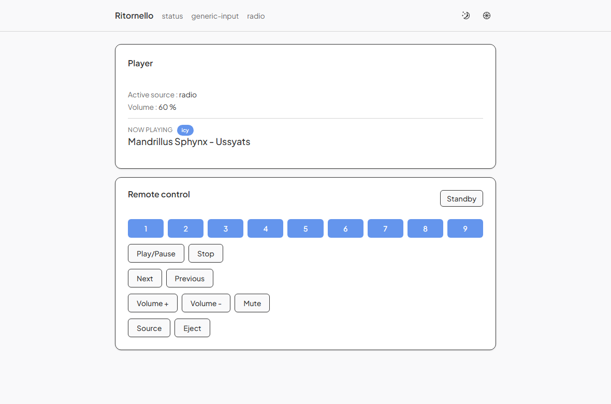
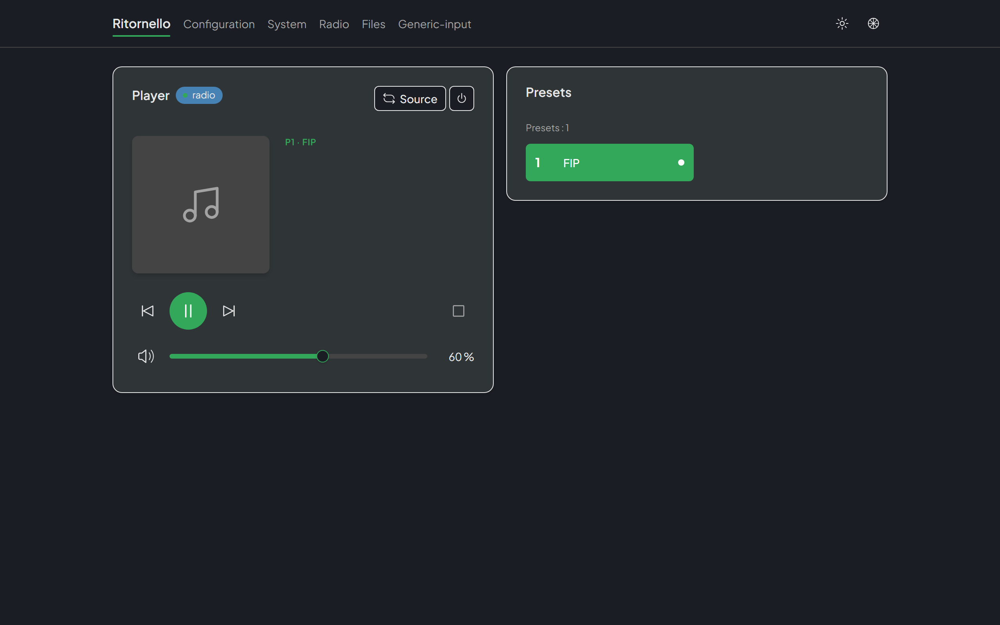
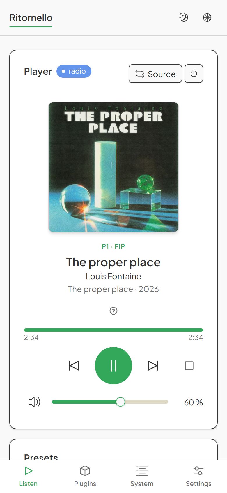
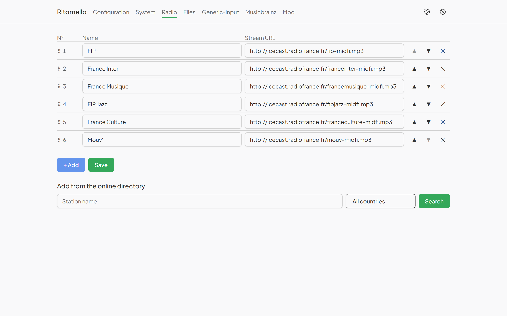

# The interface

## Web remote and command API

The home page (`http://<host>:8080/`) is a remote control built around the
Player card and the preset tiles, not a settings form: the cover and the
current track are the subject, one primary Play/Pause button dominates the
transport, and volume is a slider rather than two step buttons. It is a
single `HomeView`, a single `GET /api/player` connection (SSE, see below)
and a single set of components; the difference between the phone and the
desktop arrangement is Tailwind breakpoints, not two separate views (see
"Layout" below).

The page embeds buttons for 8 of the protocol's 17 commands: standby,
source switch, mute, previous/next, play/pause, stop, eject. Three more
commands are sent by controls that are not buttons — the preset tiles send
`Select`, the progress bar sends `SeekTo`, the volume slider sends
`SetVolume`. The remaining six belong elsewhere: `VolumeUp`/`VolumeDown`
and `SeekForward`/`SeekBackward` are the physical remote's hold-to-repeat
and step keys (see "Physical remote" below) — the web page dropped its own
±5%-volume and ±`seek_step_s`-seek buttons in this refonte, in favour of
the slider and the progress bar respectively, so these four commands no
longer have a web control at all; `Plus10` belongs to the physical remote,
which has a single key and no other way past preset 9 (the web tiles reach
the same numbers through their own page arrows, described under
"Presets"); and `SelectSource` (a source named rather than cycled to)
exists for the MPD server plugin, whose clients send `load` — see
[plugins.md](plugins.md).

`Next`/`Prev` are interpreted by the active source: preset for the radio,
track for the CD player — these are not two distinct command pairs, only a
semantic that varies with the source. A binding that still references
`NextTrack` or `PrevTrack` (the old name) is no longer valid: it must be
rewritten as `Next`/`Prev`.

The remote goes through `POST /api/command`, whose body is exactly a
protocol command — the same channel the Input plugins feed, so no business
logic is duplicated:

    curl -X POST http://<host>:8080/api/command \
      -H 'content-type: application/json' -d '{"cmd":"VolumeUp"}'
    curl -X POST http://<host>:8080/api/command \
      -H 'content-type: application/json' -d '{"cmd":"Select","arg":3}'

Handy for driving the device without a remote (from a phone on the local
network, or over SSH while debugging). Its `204` means only that the
command was **enqueued** on the same channel the Input plugins feed — not
that it was applied. The applied state (the new volume, the new preset,
whatever changed) arrives separately, on the `GET /api/player` stream
described next; a client that wants to know the outcome watches that
stream, it does not infer it from the response to its own `POST`.

The **Player** card (active source, volume, mute, standby, and the current
track with where the information came from) is fed by a pushed stream from
`GET /api/player` (SSE) — nothing is polled, and the state follows the
infrared remote as well as other browser tabs and, per the paragraph
above, the web remote's own commands.

### Layout: one page, two arrangements

A single `HomeView` renders both arrangements; the breakpoint is Tailwind's
`md`, not a separate mobile view or a fork in the code.

- **Below `md` (phone).** One column: the cover, the track block, the
  progress bar, the transport, the volume slider and the preset tiles
  stack in that order, then a fixed bottom tab bar (see "Navigation") sits
  under everything, clear of the phone's own gesture bar.
- **From `md` (desktop/tablet).** Two cards side by side, inside a
  `max-w-5xl` column: the Player card on the left (cover, track block,
  progress bar, transport, volume), the Presets card on the right. The
  navigation stays at the top of the page, as before this refonte.







### The Player card

The cover and the current track are the subject: nothing above them
competes for attention any more. A pastille badge in the card's header
names the active source (`etat.source`, or "No source" before the first
frame), with a small dot lit next to it while something is actually
playing (`playback === 'playing'`); a second badge reads "STANDBY" in
standby. The corner of the card carries the two commands that act on the
whole appliance rather than on what's playing — source switch and
standby — deliberately apart from the transport below it, which only ever
acts on the current source.

The cover is a fixed square — 224 px on the phone, 176 px on desktop, next
to the text rather than above it — so the layout never jumps when an
image arrives after the text. It never disappears: a muted square with a
music-note glyph stands in for it, both while no `cover_href` is present
and when the browser failed to load the one that was (without this flag
the browser's own broken-image icon would show instead of the intended
fallback; it resets on the next `cover_href`, so one failure doesn't
condemn the square for the rest of the session). **Clicking it enlarges it**,
full screen over a dark veil, at full resolution; clicking anywhere closes it
again, as does Escape and the close button — which is there so the view can be
left from the keyboard by something that announces itself. A track change
closes it too: the next track's image appearing full screen is not something
anyone asked for. There is no button when there is no image — the ♫ fallback is
not a picture, and a button that opens nothing is worse than none. In standby only the cover
itself dims, to half opacity (`PlayerCard.vue`'s own `opacity-50`) — not
the rest of the card: the transport, mute and source-cycle buttons look
dimmed too, but that's the kit's standard `disabled:opacity-50`, a
side-effect of being disabled (see "Buttons the appliance would ignore"
below), not a deliberate standby style, and it is why the STANDBY badge,
the header text and the Standby button itself — never disabled, standby
being the one command that still works — stay at full opacity throughout.

Above the title, a small highlighted line reads `P1 · FIP` — the preset
number in `primary` and, when the source declares one, its name after the
separator (`preset_name` in its frames — the configured station name for
the radio; the CD plugin never declares one, since a track number is not
a name). It lives and dies with `preset` below it: both clear together as
soon as nothing is playing anymore, and neither survives a source change.
Under it, the source's own `status` sentence shows when there is one and
the device isn't in standby (the "STANDBY" badge already says it): "NO
DISC", "AUDIO CD", or whatever the active source or the core itself
produced (see [plugins.md](plugins.md)). Title, artist and album follow
when at least one of the three is known; when none is, nothing is drawn
there — an "0:34" alone would inform nobody, so the block simply doesn't
appear — but the cover square stays exactly where it was, still the thing
that carries the layout. The release year, when a contributor knows it
(`year`), sits on the album line after a middle dot — "Kind of Blue ·
1959" — where a year is read; it also shows alone, since a stream may know
the year without the album. Under that line, when there is anything to put
there, comes a single bottom row: a pair of small badges saying who
supplied the text (`origin`) and, when it differs, who supplied the cover
(`cover_origin`) — the first question to ask in front of a wrong title;
then, when no position is known but a duration is, a small duration figure
— the one piece of timing information left when the progress bar (below)
has nothing to draw at all; then, on the same line as the origin badges,
when the payload carries `links`, one small icon per listening platform
(YouTube, Deezer, Apple Music — inline SVG) opens the track there in a new
tab (`rel="noopener noreferrer"`). These icons are the one deliberate
exception to "no hard-coded colour" anywhere else in this interface: each
one keeps its platform's own brand colour in every palette, light or
dark, rather than following the theme through `currentColor` — a brand is
not a colour role the theme owns. Each icon has a translated
accessible name ("Listen on YouTube"…) and sits in a 44 px touch target,
and the row reserves that height even with no link so that a link arriving
late never pushes the volume slider out from under a thumb already resting
on it; a platform this page does not know is drawn not at all rather than
under a default icon. The platform set is closed on the protocol side, the
URL having already been checked against that platform's hosts before it
ever reaches the page — see [plugins.md](plugins.md).

That stream and the display plugins' socket carry the very same
payload — `PlayerState`, one structure serialized once per transport —
rather than two views kept separately in sync. One of its fields is
carried for the displays alone: `overlay`, the transient overlay a
display plugin is showing right now (the volume/mute readout, the
remote's pending `+NN`, or a source's ephemeral message — see
[plugins.md](plugins.md) for its shape). The payload carries it because
the same structure feeds the displays, but the SPA **ignores** it: the
web UI already shows the volume in plain sight (the slider, below), and a
browser page has none of a twenty-column physical display's real-estate
constraints, so there is no cramped "now playing" line for a transient
message to interrupt in the first place. One practical consequence:
selecting an empty preset from the web remote produces no on-screen
feedback today — the "empty preset" message reaches only the physical
display, through this same field. The one toast the home page can show
(see `HomeView.vue`) is unrelated: it reports HTTP failures of
`POST /api/command`, not source-declared overlays.

Two more fields of the pushed `Morceau` carry the album cover, when there
is one: `cover_href`, **always** a local URL of the appliance, of the
form `/api/cover/{key}` — never the address the cover was actually found
at, since it is the appliance that fetches an image, not the browser
(see [plugins.md](plugins.md) for the chain that produces it) — and
`cover_origin`, described above. Both are absent when no cover is held.

Two further optional fields of the same `Morceau` feed the track block:
`year`, the release year as a number, and `links`, a list of
`{"platform":"youtube"|"deezer"|"apple_music","url":…}`. Both are
**omitted** from the frame rather than sent as `null` or `[]`, so a frame
without them is byte-for-byte what it was before they existed; the SPA
types them optional for the same reason.

### Progress bar

Under the track block, a thin bar shows the elapsed time next to the
total duration, both drawn from the pushed `position_s`/`duration_s`.
Four states, and the payload distinguishes all of them:

- **position unknown** (`position_s` absent — a stopped device, standby, a
  stream nobody follows): nothing at all is drawn, not even the elapsed
  figure;
- **position known, no duration**: the elapsed figure alone, no bar —
  a bar with no end to reach would teach nothing, so none is drawn rather
  than one that never fills;
- **duration known too, not `seekable`**: a plain filled bar with no
  handle and no keyboard focus, elapsed time and total duration both
  shown — exactly the Radio France case, where knowing you're 1:27 into a
  4:14 track has value even without being able to jump inside it;
- **duration known and `seekable`**: a real slider (the kit's `Slider`),
  draggable at the pointer over a 44 px tall contact zone around a 6 px
  visual track, and operable by keyboard (arrow keys move by one
  `seek_step_s`, Home/End jump to the ends — captured ahead of the
  slider's own handler, so the step always matches the physical remote's).

`seekable` is a field of its own rather than a deduction from `duration_s`
being known, because the two diverge exactly where it matters: a Radio
France station declares the duration of the song it names on a direct
nobody can rewind, while a plain file carrying no duration tag can still
be sought end to end — mpv knows the position best precisely there. The
bar itself, though, needs both: a file reported `seekable` with no known
duration still falls back to the elapsed-figure-alone state above (no
handle to place without an end to place it against), until a duration
arrives or the position is lost.

**Exactly one `SeekTo` leaves per gesture, at release.** While a finger or
the pointer is down, the fill and the elapsed figure follow it locally —
no command is sent yet; releasing (or a plain click) commits the value
with a single `SeekTo`. After release, the bar holds the value it aimed
for rather than the payload's, until an SSE frame arrives whose
`position_s` lands within one `seek_step_s` of it — without that, the
frame already in flight from *before* the seek would land first and drag
the handle back for an instant, on a page whose whole point is to trust
what it shows. `SeekForward` and `SeekBackward` still exist in the
protocol and drive the physical remote's stepping (see "Physical
remote"); the web page itself sends only `SeekTo`, and — like every seek
command — it is silently ignored on content that isn't seekable: no
error, no overlay. The step, `seek_step_s`, lives in the core rather than
in a key or a button, the same reasoning that already keeps the volume's
step off the volume control itself (below): a remote never has to be
reprogrammed just because the step it sends should now be bigger or
smaller. It is adjustable on its own card of the config page, 10 s by
default and bounded 1-120 s under the same `422`-on-write contract as the
timings described there.

### Transport

Three keys and a dominant Play/Pause: `|◀`, then the large `▶`/`❚❚`
button, then `▶|` — the order of a hi-fi remote and of VLC, previous/next
either side of the frequent gesture. `Stop` and `Eject` sit apart, in
retreat (to the right on desktop, at the end of the row on the phone).

**The trio is centred, not the whole row.** All five buttons used to be direct
children of one `justify-center`, so `Stop` — and `Eject` when the source has a
drawer — counted towards the centring and pushed previous/play/next left by half
their width. A flexible spacer of the same growth on the left restores the
middle of the card to the three keys that matter. It exists below `md` only:
from there the row aligns left and the secondary group goes right on `ml-auto`,
as before.
Play/Pause is the one filled, round, primary-colored button on the page —
64 px on the phone, 48 px on desktop, larger than the other three keys at
every width — and its icon now actually
follows `playback` (▶ at rest or paused, ❚❚ while playing) instead of a
fixed glyph: the field existed in the payload before this refonte and
simply wasn't read yet.

`playback`, one of `playing`, `paused` or `stopped`, is additive in the
idiom this protocol already uses twice (`InputMessage.held`,
`PluginStatus.stalled`): absent from the JSON when it is `stopped`, so no
existing frame changed shape and an older frame still reads. It is
deliberately *not* a deduction from `position_s` being known, because the
two diverge exactly where it matters — a paused playback keeps its
position, and a stream that is playing may have none at all. The core
computes it at publication from `lecture`, `standby` and a single
`paused` flag, rather than maintaining it along the five paths that stop
playback: one point cannot be forgotten, five sprinkled assignments would
be forgotten at the sixth path added. The MPD server plugin needs the
same field for its `state: play|pause|stop` (see [plugins.md](plugins.md)),
which was the original reason it was added.

**The two seek keys and both volume keys are gone from the web page.**
Decided in this refonte, on the strength of VLC, Deezer and Windows Media
Player having none either: the progress bar (above) and the volume
slider (below) do that work now. `SeekForward`/`SeekBackward` and
`VolumeUp`/`VolumeDown` remain in the protocol and drive the physical
remote (see "Physical remote") — the web page just no longer offers a
button for any of the four. Eight commands remain on the page (standby,
source switch, mute, previous, play/pause, next, stop, eject); a binding
that still expects the web UI to grey `SeekForward`/`SeekBackward` or
expose a ±volume control is stale.

**Buttons the appliance would ignore are disabled or hidden**, never
offered as if they worked:

- in **standby** the core returns without doing anything for everything
  but `Power` (the first line of `handle_command`), preset tiles
  included — those buttons used to lie: the request left, the server
  answered `204`, and nothing happened;
- `Eject` is **hidden outright** rather than merely disabled when the
  active source declares `can_eject: false` (`SourcePlugin::can_eject` —
  see [plugins.md](plugins.md)); the page never compares `source` to
  `"cd"`, a plugin name coming from `plugins.toml` and free to change
  without anything here noticing. It is a capability of the **source**,
  not of what is loaded: the CD player answers `true` with an empty tray
  too, since that is exactly when one opens it. `can_eject` is
  remembered on the same schedule as `preset_count` below: forgotten on
  a source change and on standby, kept on a stop.

`PlayPause` and `Stop` are still offered unconditionally outside standby.
That used to be for lack of knowing whether anything was playing — the
payload said nothing on the subject before `playback` existed — and it no
longer is, yet the rule hasn't been revisited on the strength of it,
deliberately: hiding *asserts* the action doesn't exist, and `Stop` on a
stopped device is a legitimate no-op rather than a non-existent one. A
state not yet received (the fraction of a second before the first frame)
disables nothing: the remote opens usable, and the first frame corrects
it.

While something plays, one frame goes out every second carrying a fresh
`position_s`, on top of whatever else changed; nothing goes out for this
reason alone at rest, since deduplication already discards a frame
identical to the last one and a stopped or standby device has no position
left to advance. A transient `overlay` in flight (ignored by the SPA, see
above, but relevant to the physical display and to the timings on the
config page) rides along untouched by this ticking.

### Volume

A horizontal slider, 0-100, the speaker icon on its left and the value in
percent on its right — no more `−`/`+` buttons, on either width. The icon
**is** the mute toggle (`aria-pressed`, a barred-speaker glyph when
muted): that's where the ear looks for the volume control in the first
place. Muting dims and strikes through the percentage figure and shows a
"MUTED" badge, but keeps the number itself legible — it's the value that
comes back once mute is lifted, same as before.

The slider sends exactly one `SetVolume` per gesture, at release
(the same commit-on-release mechanic as the progress bar above, both
built on the kit's shared `Slider`): the figure follows the pointer
locally while dragging, and the slider holds the released value until a
frame confirms it, for the same reason the progress bar does. Keyboard:
arrow keys move by 1%, Page ↑/↓ by 10%, Home/End jump to the ends — this
is what makes the slider's own `role="slider"` sufficient for
accessibility, without a pair of ± buttons alongside it.
`VolumeUp`/`VolumeDown`, with their hold-to-repeat cadence from
`GET /api/settings`, remain the physical remote's gesture (see "Physical
remote" and the config page's volume-hold card); the `SetVolume` the
slider sends is the same absolute command the MPD server plugin's
`setvol` already used (`ritornello-proto::Command::SetVolume`) — no
change on the core's side.

### Presets

A tile is a number and, when known, a name — a 56 px row on the phone,
48 px on desktop, the one matching what's playing filled in `primary`
with a trailing dot. On the tiles, the one matching **what is playing**
is highlighted: the preset for the radio, the track for the CD. The
active source is what declares it (the `preset` field of its frames, see
the protocol) — the core never interprets what `Select(n)` was supposed
to mean — and it goes out as soon as nothing is playing anymore.

The name comes from `GET /api/presets`, a read-only route added in this
refonte: it serves, as-is, the `Catalogue` the core already keeps for the
physical displays (`presets_par_source`, built from the `Preset` entries
each source declares in its `presets` frames) — no new protocol payload,
just an HTTP window onto one the core already held.

    curl http://<host>:8080/api/presets
    {"sources":[
      {"name":"radio","presets":[{"index":1,"name":"FIP"}]},
      {"name":"cd"}
    ]}

A source that doesn't enumerate its presets (the CD player, an aux input)
has no `presets` field at all, rather than an empty list — the page falls
back to bare numbers for it, same as `preset_count` below already does.
The SPA loads the catalogue once on mount and reloads it whenever the
active source changes (the SSE stream says so, nothing is polled for
this); a failed load keeps the previous names rather than blanking the
tiles, since a passing outage shouldn't un-name a station.

The tiles are not hardcoded to nine keys: the active source also
declares, in `preset_count`, the **highest preset number it is currently
using** — stations for the radio, tracks for the CD — not a literal count
of how many exist, and the page shows only the numbers up to that
ceiling. The distinction is usually invisible: through the admin pages
presets are numbered contiguously (1..N), so the ceiling and the count
coincide. A hand-edited, sparse configuration breaks that
equivalence — two stations at presets 1 and 40 declare
`preset_count: 40`, and the console display then reads "RADIO  1/40" —
which is the field doing exactly what it promises, not a bug. Absent
means the source says nothing on the subject, so the page falls back to
the historical 1-9 layout rather than being disarmed by a source that has
not been updated; `Some(0)` is a distinct, meaningful answer ("nothing to
number", an empty CD tray — the header still reads "Presets : 0", with no
tile below it). The remembered count is forgotten on a source change and
on standby (the newly active source re-declares it on activate/wake) but
**not** on stop — a stopped radio still has its stations.

Past the ninth preset, bare digits cannot reach further: the physical
remote's **`+10`** key, once bound, accumulates a tens offset held by the
**core**, cumulatively (each press adds 10), wrapping back to 0 once it
passes the last useful decade (`(count / 10) * 10`, so a count of 20
still lets `+10 +10` then `0` reach preset 20; with no known count, the
offset saturates instead of wrapping) — the web page has no `+10` button
of its own, it reaches the same numbers through its own `<`/`>` page
arrows, described next. It is shown as `+NN` through the same overlay
slot as the volume/mute overlay, but its own deadline: the config page's
`tens_window_ms` setting, 5 s by default and independent from the
volume/mute overlay's own `overlay_ms` (see the config page section
below). The `+NN` overlay lasts exactly as long as the offset stays armed
— not an arbitrary display duration, since that equality is what
guarantees a digit is never composed blind. A further `+10` within that
window extends it rather than starting a new one. The next digit
(`Select`) consumes the pending offset — effective number = offset +
digit — and clears the overlay; any other command abandons a pending
offset outright, since pressing, say, a volume key mid-sequence is a
change of mind, not a step of it. Key **`0`** is legal input for exactly
this: alone, with no offset pending, `Select(0)` selects nothing (there
is no preset 0).

The web page mirrors the same decade window **locally**, through two
`<`/`>` arrows next to the "Presets : N" count (shown once it exceeds
nine) instead of a `+10` button: page 0 is 1-9, page k is 10k to 10k+9 —
the same boundaries as the core's offset, so both interfaces agree on
what "the same page" means. Unlike the core, the page does **not** wrap:
`<` is disabled on the first page and `>` on the last, and there is no
auto-return to page 0. The physical remote wraps because it has a single
key and no way back, so wrapping is its only way to reach everything; a
pair of arrows has a way back, so wrapping would just be gratuitous and
confusing. Picking a preset does not change page either — trying several
presets from the same group should not require paging back each time.
The browser always sends the absolute number to `Select`.

**The page follows what is playing.** On arrival and whenever the
highlighted preset moves to another decade — the infrared remote's
`+10`, another browser tab, a CD stepping from track 9 to 10 — the tiles
place themselves on the page containing that number. Without it the page
asserted 1-9 while station 24 played, and the highlight that answers
"which preset are we on" was only visible after paging to it by hand. The
number is clamped to the last non-empty page, so a source declaring a
preset beyond its own count cannot open an empty page. With no preset
declared, a **count** change (another source, an ejected disc) resets to
page 0 — that is what carries the "changing source returns to the first
page" guarantee. A plain stop does not move the page: the count survives
a stop, and so does the page. Paging by hand survives every frame that
changes neither the preset nor the count.

### Navigation

**From `md` up**, the top bar carries the brand, a link to the config
page ("Configuration"), one to the system page, and one per plugin with
an admin backend, in the order `/api/status` reports them (so, of
`plugins.toml`) — unchanged from before this refonte.

**Below `md`**, the top bar is replaced by a fixed bottom tab bar, four
entries whatever the number of plugins: **Listen** (this page),
**Plugins**, **System**, **Settings** (the config page, under its short
label). Tapping "Plugins" opens `/plugins/`, a list of every plugin with
an admin page — same order and the same connected/unavailable badges as
the config page's own table — **or**, when exactly one plugin has an
admin page, that page directly: a one-entry list would teach nothing a
direct link doesn't. The route exists either way; nothing on desktop
links to the list itself, the top bar already shows each plugin.



Icons throughout the remote, the volume, the transport and the
navigation come from `@radix-icons/vue` (already a dependency, for the
theme toggle); the handful Radix doesn't have — eject, standby — are
small hand-drawn stroke SVGs in the same 15 px grid, kept next to the
components that use them (`components/icones/`). The admin pages of
individual plugins are untouched and keep their own glyphs.

## Physical remote

If a key does not respond, open `http://<host>:8080/plugins/generic-input/`,
pick the device from the list ("Refresh" button if it was just plugged
in), click "Learn" on the action's row, press the key, then "Save". No
restart is needed: the table is re-read on every key press. To start from
a base, load the `mce` or `keyboard` preset.

The "press a key" prompt is a **dialog**, naming both the action and the
device it is listening to, and it waits half a minute — long enough to hunt
for the right key on an unfamiliar remote. Escape, the veil, the cross and
"Cancel" all give up on it, and all cancel the listening session on the
device rather than just closing the box. Its checkbox **adds** the captured
code to the ones already on that row instead of replacing them, which is
how one action ends up answering to several keys of the same device — that
remote's "OK" and its "Play" both driving play/pause, say.

One code on two actions is the mistake the page will not let you save: both
fields turn red **as you type**, each naming the other action, and "Save"
stays out of reach until one of them lets the code go. The plugin refuses
such a table anyway; the page merely says so before the round trip rather
than after it.

## Config page

The former status page is now the **config page**, at
`http://<host>:8080/config` — `/status`, its historical URL, redirects
there, so existing bookmarks and links keep working. It lists the
plugins with their connection state and admin link, the audio output and
language pickers (below), the four settings cards described here, and
the recent error log.

A **sticky table of contents** sits alongside the cards (from the `lg`
breakpoint up): the entry for the section currently scrolled into view is
highlighted — an `IntersectionObserver` watches each section against a
band at the top of the viewport, and the first section still visible
there wins, so the highlight tracks what's actually being read rather
than whichever callback fired last. Clicking an entry scrolls smoothly to
its section.

### Audio output picker

Backed by `GET`/`PUT /api/audio-output`. The list comes straight from
`aplay -L`: each entry shows the device's **description** first, its
technical ALSA name in small print beneath — the `null` PCM (discards
audio) is filtered out, it has no place in an audio chain.

The first entry, **"System default"**, sends `device: null`: no device is
imposed on mpv (`audio-device=auto`), so the OS default applies. That is
the state of a fresh install — `audio_device` is `None` until a device is
explicitly picked — and it stays available afterwards to go back to
"whatever the system decides". A `PUT` with a named device persists it in
`state.json` and pushes it to mpv immediately; the currently selected
device is kept visible even if it disappears from `aplay -L` (a card
unplugged since), rather than leaving the picker blank.

### Startup card

Whether the device starts **on** (resumes the active source), in
**standby**, or in the **previous state** — whatever it was doing when it
last stopped. On by default. Persisted in `state.json`
(`settings.startup_power`, one of `on` / `standby` / `previous`) and read
once at process start, so a device configured for standby boot does not
start playing again on its own after a power cut or a reboot.

"Previous state" reads a second persisted field, `standby`, written on
every transition — the two halves of the `Power` key and both branches of
startup — so it describes what the device was actually doing rather than an
intention: on after a crash mid-listening, standby after a power cut that
followed a deliberate standby.

### Volume-hold card

The two timings that pace a **held** volume key on the physical remote
(`VolumeUp`/`VolumeDown`; the web remote's volume is a slider and has no
hold gesture of its own — see "Web remote and command API" above): the
delay before the first repeat, and the interval between the following
ones. Backed by
`GET`/`PUT /api/settings`, with bounds enforced on write (a `PUT` outside
them answers `422`): initial delay **200-5000 ms**, interval **100-2000
ms**.

### Overlays card

Two more durations, both 5 s by default and bounded **1000-15000 ms**
(same `422`-on-write contract), backed by the same `GET`/`PUT
/api/settings`: `overlay_ms`, how long the volume/mute overlay and a
source's transient messages (e.g. "empty preset") stay on screen before
the "now playing" view returns; and `tens_window_ms`, the remote's `+10`
entry window described above. They are deliberately two independent
settings, not one shared timer: the volume/mute overlay may want to
shrink one day without shortening the time left to key in a two-digit
preset, and vice versa.

### Seek step card

One setting, `seek_step_s`: how far `SeekForward` and `SeekBackward` move
in what's playing, in seconds. 10 s by default, bounded **1-120 s** (same
`422`-on-write contract, backed by the same `GET`/`PUT /api/settings`).
Living in the core rather than on the key means the same reasoning as the
5% volume step: a remote never has to be reprogrammed just because the step
it sends should now be bigger or smaller.

### Album covers card

Six settings on the same `GET`/`PUT /api/settings` and the same
`422`-on-write contract, and the card's layout carries a distinction that
matters more than any of the values.

**`cover_source_max_mio`** comes first and is never greyed out: it bounds
what the core agrees to *read*, whatever happens next, and it is the only
guard left when re-encoding is off. 20 MiB by default, bounded **1-20** —
the upper bound is `COVER_MAX_BYTES` expressed in the setting's unit, not a
comfort choice. That constant is the promise made to display plugins about
what they may receive, and the MPD plugin sizes its own bounds on it without
being able to read the core's settings, so this setting can only lower it.
It is also the cheapest guard of the lot: judged on the file's size, before a
single byte of its content is read.

**`cover_rendition`** is the switch. On (the default), the core renders a
thumbnail before pushing a cover on a socket; off, the original bytes are
pushed as they are, and the memory peak of one publication goes from about
1.8 MiB back to about 72 MiB for a 20 MiB cover — the bytes, their base64,
and the JSON line. A defensible choice on a machine with the RAM, but one to
make knowingly. The switch greys the four settings below, which describe
nothing but the thumbnail; it does not clear them, so their values still
travel in the `PUT` and re-checking the switch finds what was set.

**`cover_max_edge_px`** (640, bounded 64-2048) is the thumbnail's longest
edge, aspect ratio preserved. **`cover_jpeg_quality`** (85, bounded 40-100)
applies to JPEG only: a cover with an alpha channel is re-encoded to PNG,
losslessly, because flattening its transparency would mean picking a
background colour — a visual decision the device has no business making on
someone else's artwork. The pushed frame's mime always states the format
actually produced. **`cover_max_bytes_ko`** (512, bounded 32-8192) is a net
rather than a target: the edge already bounds the pixel count, so a thumbnail
only passes it on a pathologically noisy image, and past it nothing is pushed
and the log names the setting.

**`cover_max_pixels_mpx`** (16, bounded 1-64) is the decompression-bomb
guard, and the only one that really protects: a file's size says *nothing*
about what decoding it costs. A 200 KiB PNG can declare 30000 × 30000
pixels, which is 3.6 GiB of buffer. Dimensions are read from the header
before any allocation, and the value is also handed to the decoder's own
allocation limit, covering a header that lies about itself. The useful figure
is not the megapixel count but the memory it costs — `w × h × 4`, so 16 Mpx
is 64 MiB — which is why the label carries the arithmetic.

The order of those steps is the protection, not an implementation detail:
header dimensions, then the pixel guard, then the pass-through for an image
already small in *both* pixels and bytes, then decode and encode on a
blocking thread. Swapping the last two would let a bomb through on its
weight, since a bomb is precisely a file that is tiny in bytes and immense in
pixels.

Two consequences worth knowing. Nothing is memoised: the cache key hashes the
*path*, not the content, so a kept thumbnail would go stale the moment
someone replaces the image under that path — and replacing it is exactly the
triggering gesture. And with re-encoding on, a cover whose bytes do not
decode is dropped: the header check only reads magic bytes, so a truncated
file used to pass it and reach every display, each showing a broken square
its own way. The device now settles it once, centrally.

The rendition serves the HTTP route too, but **only on request**.
`GET /api/cover/{key}` still streams a local file without ever holding it
whole; `GET /api/cover/{key}?taille=vignette` returns the same rendition the
displays get. The web page asks for the thumbnail in its 224 px square and for
the bare URL in the enlarged view — loading a NAS's three-megabyte `folder.jpg`
into a 224 px square was pure waste over Wi-Fi, while enlarging it deserves
every pixel. The default stays "as it is", because `cover_href` is published in
the state for every consumer of the protocol, present and future: the thumbnail
is a service rendered to whoever asks, not a change in what the bare URL means.
An unknown value falls back to full size rather than refusing the request — a
typo in a URL must not blank the cover.

Unlike the push path, these thumbnails **are** memoised — four of them, and the
distinction is entirely in the key. `ligne` could memoise nothing because its
key hashes the path; here the key carries the ETag as well (the file's mtime
and size), so replacing the image under that path changes the key and the old
thumbnail is never served again. Without it every page load would decode and
re-encode on a Pi 2, which is the very cost the thumbnail exists to avoid.

## System page

`GET /api/system` reports OS metrics. **Every metric is optional and is
`null` when the machine does not expose it** — no thermal zone under WSL, no
cpufreq in most VMs, no `rpi_volt` sensor outside a Raspberry Pi — while the
set of keys stays stable:

```json
{
  "temperature_c": 47.8, "cpu_mhz": 900, "load": [0.12, 0.15, 0.09], "cpus": 4,
  "memory": { "total_kb": 948000, "available_kb": 512000 },
  "disk": { "total_kb": 30000000, "available_kb": 24000000 },
  "under_voltage": false, "under_voltage_since_boot": false,
  "uptime_s": 84213, "service_uptime_s": 3600,
  "hostname": "ritornello", "ip": "192.168.1.20",
  "os": "Debian GNU/Linux 12 (bookworm)", "kernel": "6.6.51+rpt-rpi-v7",
  "version": "0.1.0", "can_power_off": true, "can_reboot": true,
  "logind_reachable": true,
  "cpu_total_jiffies": 9880976, "cpu_idle_jiffies": 9877777
}
```

Sources: `/sys/class/thermal/thermal_zone0/temp`,
`cpu0/cpufreq/scaling_cur_freq`, `/proc/loadavg`, `/proc/meminfo`
(`MemAvailable`, not `MemFree`), `statvfs("/")` (`f_bavail`, so the blocks
reserved for root are not counted as free), the `rpi_volt` hwmon
`in0_lcrit_alarm`, `/proc/uptime`, `/proc/sys/kernel/{hostname,osrelease}`,
`/etc/os-release`, `/proc/stat`'s aggregate `cpu ` line. The IP address is
the local end of a UDP socket *connected* to a routable address: no packet
is sent and no internet access is needed — the kernel is merely asked
which interface faces the default route.

`under_voltage` is the *instantaneous* alarm — it can flip back to `false`
between two polls, and an episode lasting milliseconds is easy to miss
entirely at a 5 s poll interval, or slower. `under_voltage_since_boot`
answers a different question — has this ever happened since the device
booted — from the firmware's own sticky flag (`vcgencmd get_throttled`,
bit 16 of the mask; the kernel exposes no sysfs/procfs equivalent). It only
ever turns `true`, never back to `false`, because the firmware itself only
clears it at reboot: once seen `true`, the core stops spawning `vcgencmd`
at all, since nothing further can change the answer. `null` on anything
short of a Raspberry Pi with `vcgencmd` reachable (missing binary, `video`
group not granted — see [installation.md](installation.md)).

`cpu_total_jiffies` and `cpu_idle_jiffies` are cumulative counters since
boot, not a percentage: a percentage is a delta, so the page differences
its own successive polls rather than the core remembering a previous
reading — shared state that two browser tabs polling out of phase would
corrupt. `cpu_idle_jiffies` is `idle + iowait`, because `iowait` is time
spent waiting on a disk, not doing work, the same way `top` treats it.

`can_power_off` and `can_reboot` answer logind's `CanPowerOff`/`CanReboot`,
asked **once at startup** and cached: the page polls, and spawning `busctl`
twice per poll would be absurd. Installing the polkit rule therefore takes
effect at the next service start (see
[installation.md](installation.md#shutdown-and-reboot-from-the-web-ui)).

`logind_reachable` says whether that probe got an answer **at all**, and the
page needs it to pick which sentence to show under the two disabled buttons.
An answered "no" means the polkit rule is missing; no answer at all means
logind itself is not there — a masked or unloadable `systemd-logind`, which
no polkit rule will fix. The two look identical from the buttons alone, and
naming the wrong one costs an evening.

`POST /api/system/power` takes `{"action": "poweroff" | "reboot" |
"restart-service"}`. An unknown action is refused with `422` and a
catalogue-resolved `error` message. `poweroff` and `reboot` run `systemctl`
and wait up to 5 s: `202` when it succeeds or is still running (the machine
is going away); `502` when it refuses, carrying **logind's own message
verbatim** whenever it wrote one — that sentence names the missing polkit
rule, which a silent `202` would hide, and it is never translated — or a
catalogue fallback naming the exit code when stderr was empty; `500` when
`systemctl` could not be started at all, with the underlying error folded
into a catalogue phrase.
`restart-service` answers `202`, sends `SIGTERM` to mpv, and exits the process
300 ms later; systemd restarts it because the unit says `Restart=always`. It
needs no privilege, which is why there is no `can_restart_service` field.
Outside systemd, that action stops the process for good.

Killing mpv explicitly is not redundant: it is spawned with
`kill_on_drop(true)`, but `std::process::exit` does not unwind and so runs no
`Drop`. Without the signal mpv outlived the core and kept playing, holding the
audio device the restarted core wants back. The service never showed it —
systemd kills the unit's remaining cgroup processes before restarting — so the
symptom only appeared in a development run, where nothing supervises.

The SPA polls `GET /api/system` rather than receiving a stream: unlike the
player state, which the core produces anyway, these metrics exist only
because someone asked for them. The poll starts when the SPA loads and runs
until the page closes — from any page, System tab open or not, hidden tab
included — and only a confirmed power action suspends it. Only a shutdown
leaves it suspended: after a service restart or a device reboot the page
waits for the core to answer again — up to 30 s for the service, up to 120 s
for a full reboot, a Pi taking 20 to 40 s on healthy hardware — and then
resumes the poll. Leaving it suspended would freeze the graph on *every*
page until a full reload, with nothing on screen to say why. That is a
deliberate reversal of the rule that used to stand here ("do not make a
mostly idle device work for nobody"): a history graph that measures only
while someone watches it teaches nothing, and reading `/proc` every 5 s
costs nothing measurable. One reservation, accepted: browsers throttle a
hidden tab's timers, so samples taken while the tab is in the background are
spaced out rather than regular — the graph stays truthful because its x axis
comes from the sample timestamps, not from the rank of each point.

The period is chosen on the System page — 1, 2, 5, 10, or 30 s, defaulting
to 5 s — and lives with the poll rather than with the page: it survives
navigation, and only a full reload brings it back to 5 s. It is persisted
nowhere, neither in `localStorage` nor in `/api/settings`, being a viewing
comfort rather than a device setting. The history graph carries three curves
— CPU, RAM, and, on a machine with a sensor, temperature in °C plotted on
the same 0-100 axis, a Pi's temperatures living in that range and the legend
carrying the unit — over 240 samples at the chosen period: 20 minutes at the
default 5 s, 4 minutes at 1 s, two hours at 30 s. Nothing is stored, and
nothing is lost on navigation either — which is the whole reason the poll
moved out of the page.

The "Recent errors" card at the bottom shows the 8 most recent WARN/ERROR
lines from `GET /api/logs`; a button opens a dialog over the whole buffer
(500 lines), with a field that filters it. Eight lines rather than the
buffer: unrolled in the page, they would push everything else off the
screen.

## Internationalization (i18n)

The interface is multilingual. The base language is **English**, embedded
in every binary; French (and other languages) are provided by **external
TOML packs**, decentralized per component:

    /etc/ritornello/locales/
      common/fr.toml   # shared vocabulary (play/pause/stop/error…)
      core/fr.toml     # core text + config page
      radio/fr.toml    # radio plugin + admin page
      cd/fr.toml       # cd plugin
      <third-party-plugin>/fr.toml

- Root configurable through `RITORNELLO_LOCALES` (default
  `/etc/ritornello/locales`).
- Language **picker** on the config page (`/config`): it lists `en` plus
  every `core/<lang>.toml` pack present, each language shown by its name
  in its own language ("Français", "English"). The change is applied live,
  pushed to the plugins, and persisted (`state.json`).
- **Adding a language**: copy the reference `en`, translate the values,
  drop it under `<root>/<component>/<lang>.toml`. A missing key or pack
  automatically falls back to English (per-key degradation, never an
  error). A pack that is present but unreadable (permissions, invalid
  TOML) is ignored **with a trace in the logs**.
- The initial French packs ship in `deploy/locales/` and are copied by
  `deploy/deploy.sh`.

## Theme

The interface offers a **light/dark** toggle and a picker opening a dialog
with the **42 themes** from [tweakcn](https://tweakcn.com) (Apache-2.0).
This is a **device** setting, like the language: it is persisted in
`state.json` (`theme` and `mode` fields) and therefore applies to every
browser visiting the interface. Default: `northern-lights`, light mode.

The fonts declared by the themes are loaded from a CDN — the interface's
only external resource. Offline, the display falls back to the system font
with no other consequence.

To regenerate the presets from upstream:
`cd web/kit && node scripts/fetch-presets.mjs`.
